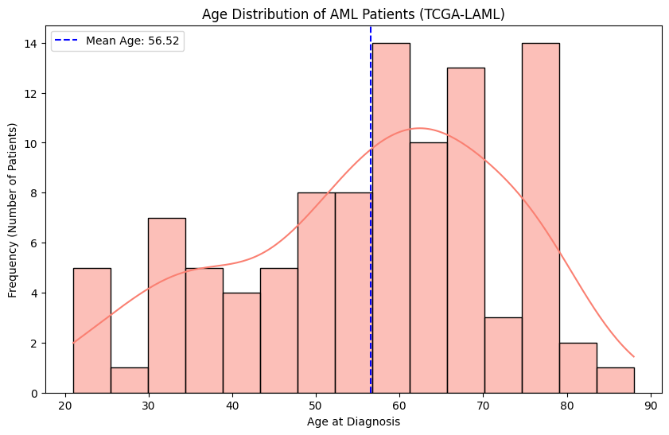
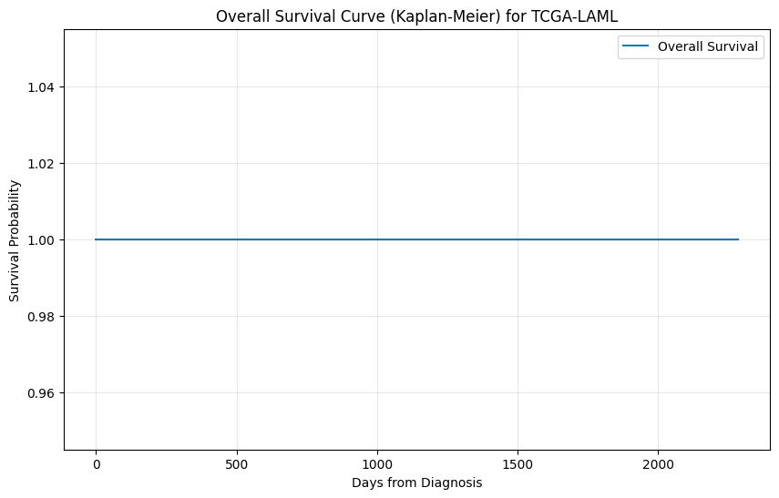

# 🧬 AML Multi-Omics Biomarker Discovery

### An integrated bioinformatics pipeline for clinical, transcriptomic, methylation, and mutation data analysis using TCGA Acute Myeloid Leukemia (LAML) datasets.

---
## 📈 Project Status

**Status:** 🟡 Ongoing

**Dataset:** TCGA-LAML

**Programming Language:** Python

**Analysis:** Multi-Omics Integration

**Current Stage:** Survival Analysis & Biomarker Discovery
---
## 📌 Abstract

Acute Myeloid Leukemia (AML) is a heterogeneous hematological malignancy characterized by substantial genomic and clinical variability.

This project presents an integrated bioinformatics workflow for analyzing publicly available TCGA-LAML datasets by combining:

- Clinical data
- RNA-Seq gene expression
- DNA methylation
- Somatic mutation profiles

The objective is to identify prognostic biomarkers associated with patient survival and molecular risk.

---
## ⭐ Project Highlights

- 🧬 Integrated multi-omics analysis of **TCGA-LAML** data.
- 📊 Clinical cohort characterization and quality assessment.
- 🧬 RNA-Seq transcriptomic analysis.
- 🧪 DNA methylation integration.
- 📈 Kaplan–Meier survival analysis using Lifelines.
- 🔬 Identification of candidate prognostic biomarkers.
- 💻 Developed using Python and open-source bioinformatics libraries.

   ---
## 🎯 Project Objectives

The main objectives of this project are:

- Integrate multi-omics datasets from TCGA-LAML.
- Identify prognostic biomarkers associated with AML survival.
- Explore transcriptomic and methylation alterations.
- Investigate the relationship between genomic alterations and clinical outcomes.
- Build a reproducible bioinformatics workflow using Python.
---
# 📊 Results & Visualizations

## 1. Cohort Demographics

The clinical cohort was explored before downstream analyses.

- Balanced male/female distribution
- Mean diagnostic age: **56.5 years**
- Higher AML prevalence in patients older than 60 years

<p align="center">


</p>

<p align="center">
<b>Figure 1.</b> Demographic characteristics of the TCGA-LAML cohort.
</p>

---

## 2. Survival Analysis

Kaplan–Meier survival analysis was performed using the Lifelines Python package.

Patients were stratified according to:

- Age
- Molecular risk

<p align="center">


</p>

<p align="center">
<b>Figure 2.</b> Overall survival analysis.
</p>

---

# 🧠 Biological Interpretation

The analysis indicates that genomic alterations contribute substantially to AML prognosis.

Key observations include:

- TP53 mutations are associated with poor survival.
- Transcriptomic alterations suggest metabolic reprogramming.
- Multi-omics integration improves biological interpretation compared with single-omics analysis.

---

# 🔬 Methods

### Software & Libraries

- Python 3.12
- Pandas
- NumPy
- Matplotlib
- Biopython
- Lifelines

### Dataset

- TCGA-LAML (The Cancer Genome Atlas)
- Genomic Data Commons (GDC) Data Portal
### Data

- TCGA-LAML
- GDC Data Portal

---

# 📁 Project Structure

```
AML-Multi-Omics-Biomarker-Discovery/

├── data/
├── figures/
├── scripts/
├── results/
├── tests/
├── README.md
└── requirements.txt
```

---

## 🚀 Future Work

- Differential Gene Expression Analysis (DESeq2)
- Gene Ontology (GO) Enrichment Analysis
- KEGG Pathway Analysis
- Protein–Protein Interaction (PPI) Network Analysis
- Machine Learning-based Biomarker Prediction
- External Validation Using Independent AML Cohorts

---

# 📚 References

- Ley TJ et al., NEJM (2013)
- Papaemmanuil E et al., NEJM (2016)

---

**Project Status:** 🟡 Ongoing Research Project
