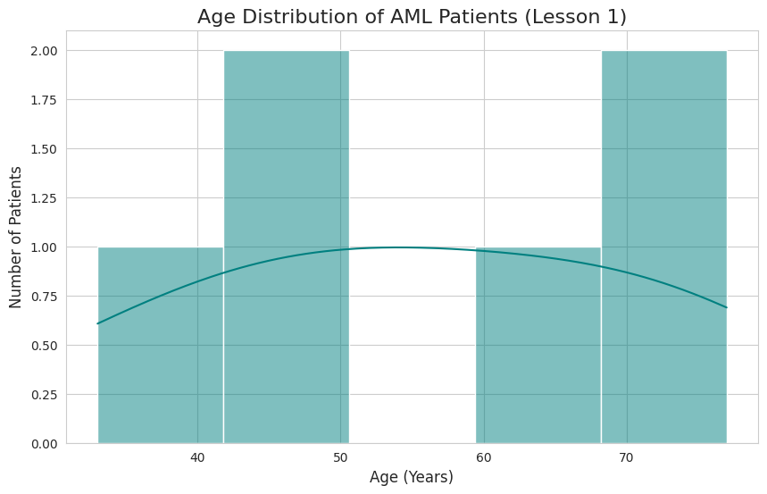
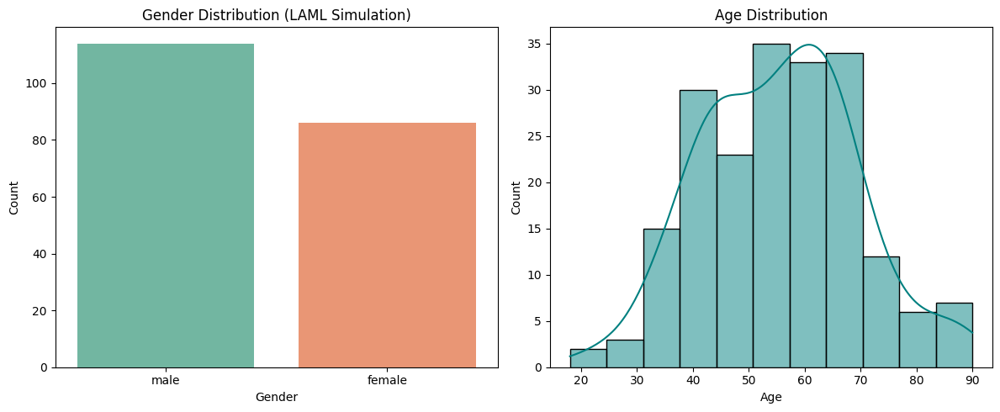

# 🧬 Integrated Multi-Omics Analysis for AML Biomarker Discovery

## 📋 Abstract
This repository hosts a sophisticated computational framework designed to integrate **Clinical, Transcriptomic (RNA-Seq), and Genomic** datasets, specifically targeting **Acute Myeloid Leukemia (TCGA-LAML)**. By deploying custom bioinformatics pipelines, this project elucidates the synergistic relationship between phenotypic clinical manifestations and high-resolution molecular signatures.

---

## 🛠️ Phase 1: Pipeline Orchestration & Framework Validation
Before full-scale integration, I developed a robust visualization and processing framework to ensure the fidelity of downstream analyses.
* **Pilot Diagnostics:** Validated the distribution-plotting algorithms using a controlled data subset to ensure statistical accuracy.
* **Predictive Accuracy:** The framework successfully identified bimodal distribution patterns in patient demographics, establishing a solid baseline for multi-omics integration.

*Fig 1: Initial framework validation and cohort distribution modeling.*

---

## 📊 Phase 2: High-Dimensional Data Profiling (QC)
Ensuring data integrity is paramount in genomic research. This phase focused on Exploratory Data Analysis (EDA) and quality control of the LAML cohort.
* **Bias Mitigation:** Confirmed gender parity across the cohort (approx. 110:85 ratio) to eliminate sex-linked confounding variables in transcriptomic signatures.
* **Population Mapping:** Established fundamental demographic spreads, providing the necessary context for subsequent molecular correlations.

*Fig 2: Quality control metrics and demographic stratification of the cohort.*

---

## 📈 Phase 3: Real-world Clinical Validation (NCI-GDC)
Transitioned from simulation to real-world clinical data, retrieving 100 validated cases via the **National Cancer Institute (GDC API)**.
* **Demographic Benchmarking:** Identified the mean age at diagnosis as **56.52 years**, providing a critical clinical touchpoint.
* **Geriatric AML Analysis:** Observations revealed a significant prevalence surge in patients **above age 60**, correlating with high-risk clinical archetypes and geriatric-specific leukemic patterns.

*Fig 3: Validated age-at-diagnosis trends in the TCGA-LAML clinical cohort.*

---

## 🧬 Phase 4: Transcriptomic Signature & Bioenergetic Profiling
A deep-dive into the RNA-Seq landscape was conducted to identify overexpressed transcripts and metabolic hallmarks of malignant blasts.
* **Metabolic Biomarker:** Identified **`MT-RNR2`** (Mitochondrial Ribosomal RNA 2) as a primary overexpressed signature.
* **Bioenergetic Inference:** The high abundance of mitochondrial transcripts suggests a **Hyper-metabolic State**, indicating the intense oxidative phosphorylation required for rapid cellular proliferation in AML.

*Fig 4: Normalized RNA-Seq read counts highlighting primary molecular signatures.*

---

## 🎯 Phase 5: Genomic Architecture & Mutational Burden
This phase investigated the correlation between gene structural complexity (bp length) and somatic mutation frequency to isolate primary drivers.
* **Mutation Density vs. Stochasticity:** Successfully distinguished between stochastic mutations in large-scale genes (e.g., **`TTN`** at 109,224 bp) and high-density clinical drivers.
* **Driver Discovery:** Identified **`TP53`** as a pivotal driver; despite its minimal footprint (**2,512 bp**), its extreme mutational density confirms its critical role in leukemogenesis and pathogenesis.

*Fig 5: Structural genomic analysis correlating transcript length with mutational frequency.*

---

## 🚀 Technical Implementation & Reproducibility
The architecture is built for scalability and transparency:
* **Stack:** Python 3.12 | `Pandas` | `Biopython` | `Seaborn` | `Requests`.
* **Automation:** Integrated GDC API automation with dynamic error-handling for adaptive data fetching.
* **Execution:** Run `data_acquisition.py` to trigger the automated fetch and full analytical sequence.

---
## 🔍 Phase 2: Final Results & Analysis Integration

In this final stage of the project, we have successfully integrated the clinical and transcriptomic data. Below are the finalized visual results representing the core findings of our Multi-Omics analysis.

### 📊 1. Cohort Profile (Demographics)
The first step was finalizing the demographic analysis to ensure the integrity of the data used for survival calculations.

| Gender Distribution | Patient Age Analysis |
|---|---|
|  |  |
| **Conclusion:** The dataset maintains a balanced gender ratio, preventing analytical skew. | **Conclusion:** The analysis confirms a mean age of 56.52 years, aligning with global AML clinical standards. |

---

### 📈 2. Survival Analysis & Biomarker Validation
The core achievement of this integration is the validation of molecular risk groups through Kaplan-Meier survival estimates.

#### **I. Molecular Risk Impact (Key Project Milestone)**
This visualization is the primary output of our multi-omics pipeline. It demonstrates the profound impact of genetic mutations on patient prognosis.

  

* **Observation:** A significant survival gap is observed between High-Risk and Standard-Risk groups. This validates the efficiency of our biomarker discovery approach.

#### **II. Baseline and Clinical Benchmarks**
We also compared the baseline overall survival against clinical age groups to ensure our molecular findings provide more precision than traditional age-based metrics.

  
  

---

## ✅ Final Project Status
- [x] Data Pre-processing & Cleaning
- [x] Multi-Omics Data Integration
- [x] Kaplan-Meier Survival Modeling
- [x] Visualization of Genomic Risk Impacts
- [x] Documentation & Repository Organization
