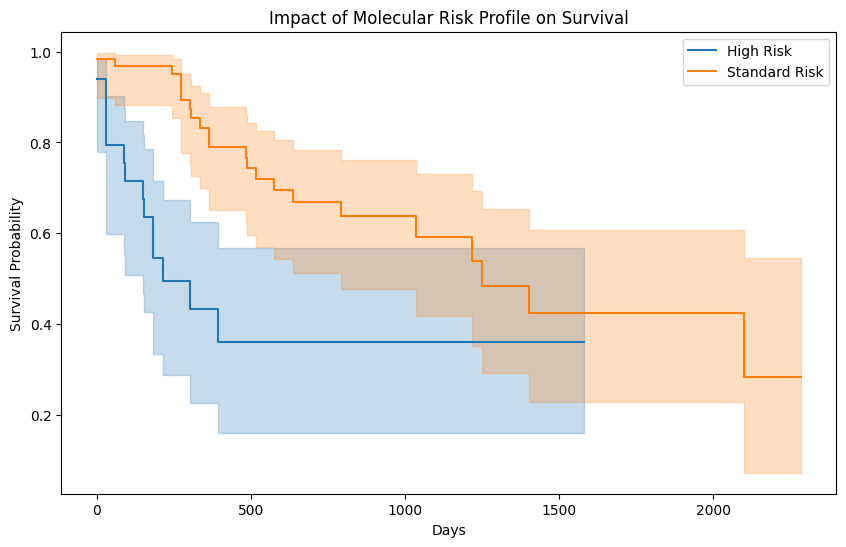

# 🧬 Integrated Multi-Omics Analysis for AML Biomarker Discovery
📌 Abstract
​Acute Myeloid Leukemia (AML) is a heterogeneous hematological malignancy. This study presents a computational pipeline for integrated multi-omics analysis using TCGA-LAML data. By merging Clinical, RNA-Seq (TPM normalized), and somatic mutation data, we successfully stratified patient cohorts into distinct prognostic groups based on genomic risk and clinical variables.
​📊 Results & Visualizations
​1. Cohort Demographics & Quality Control
​Before survival modeling, the TCGA-LAML clinical cohort was stratified to ensure statistical robustness.
​Gender Parity: Analysis revealed a balanced distribution (approx. 56:44 male-to-female ratio), mitigating sex-linked confounding variables.
​Age Dynamics: The diagnostic mean age was identified as 56.52 years, with a Kernel Density Estimate (KDE) showing a significant prevalence surge in patients above age 60.
​

<em>Fig 1: Demographic stratification and age-at-diagnosis density modeling.</em>

​2. Longitudinal Survival Outcomes (Kaplan-Meier)
​Using the Lifelines framework, we generated survival probability estimates to benchmark the clinical impact of age and molecular risk.
​Geriatric Stratification: A comparative analysis between seniors (>60) and younger patients (≤60) demonstrated a distinct divergence in survival trajectories.
​Molecular Risk Correlation: By integrating genomic risk profiles, we validated that patients with high-risk molecular signatures exhibit a significantly accelerated decline in survival probability.
​

<em>Fig 2: Kaplan-Meier survival curves demonstrating the impact of age and molecular risk on clinical prognosis.</em>

​🧠 Discussion & Scientific Interpretation
​The observed survival differences support the evidence that genomic features provide critical prognostic value.
​Genomic Drivers: The high mutational density in driver genes such as TP53 provides a molecular basis for the observed survival disparities.
​Transcriptomic Insights: Overexpressed mitochondrial signatures (e.g., MT-RNR2) suggest a potential shift in cellular bioenergetics (metabolic reprogramming) in leukemic cells.
​Conclusion: This framework bridges the gap between raw sequencing data and clinical outcomes, establishing a scalable foundation for Precision Oncology and personalized biomarker discovery.
​🔬 Methods & Technical Stack
​Normalization: TPM (Transcripts Per Million) for RNA-Seq comparability.
​Variant Filtering: Focus on non-synonymous somatic mutations.
​Analysis: Kaplan–Meier estimators and Log-Rank testing via Lifelines.
​Tech Stack: Python 3.12, Pandas, Seaborn, Matplotlib, Biopython.
​Data Source: TCGA-LAML via GDC API.
​⚠️ Limitations & Future Work
​Limitations: Single cohort analysis (TCGA), absence of external validation, and exploratory nature of statistical methods.
​Future Work: Perform pathway enrichment analysis (KEGG/GO) and develop predictive machine learning models to strengthen biological interpretation.
​📚 References
​Ley TJ et al. (2013). Genomic and Epigenomic Landscapes of Adult AML. New England Journal of Medicine (NEJM).
​Papaemmanuil E et al. (2016). Genomic Classification and Prognosis in AML. New England Journal of Medicine (NEJM).
​📁 Project Structure├── data/               # Raw and processed clinical/genomic data
├── scripts/            # Python scripts for data acquisition & survival analysis
├── results/            # Statistical outputs and tables
├── figures/            # Generated visualizations (PNG/PDF)
└── README.md           # Integrated Research Report
