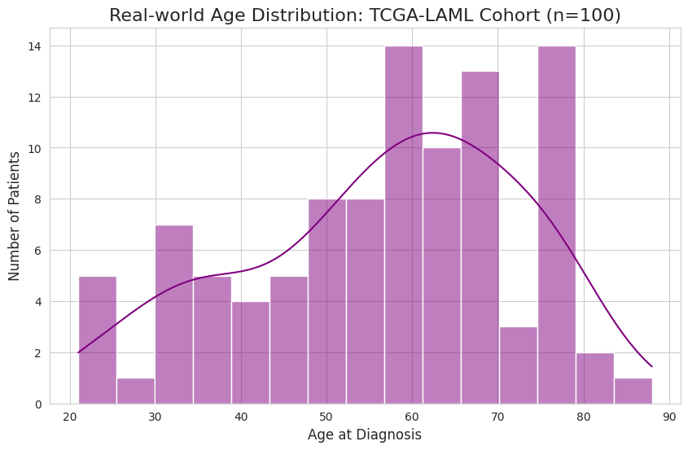
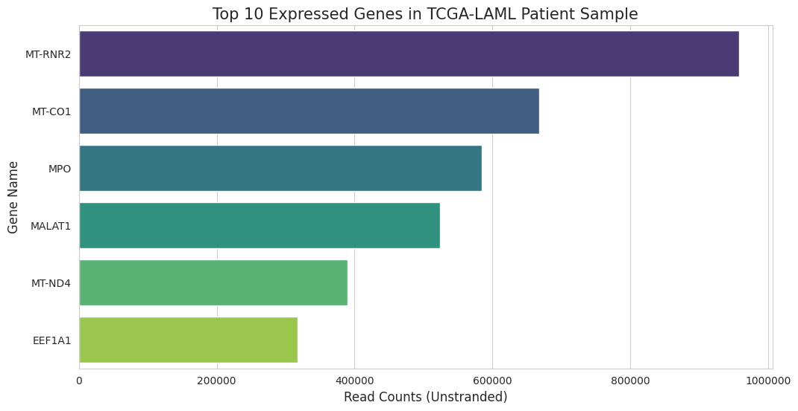
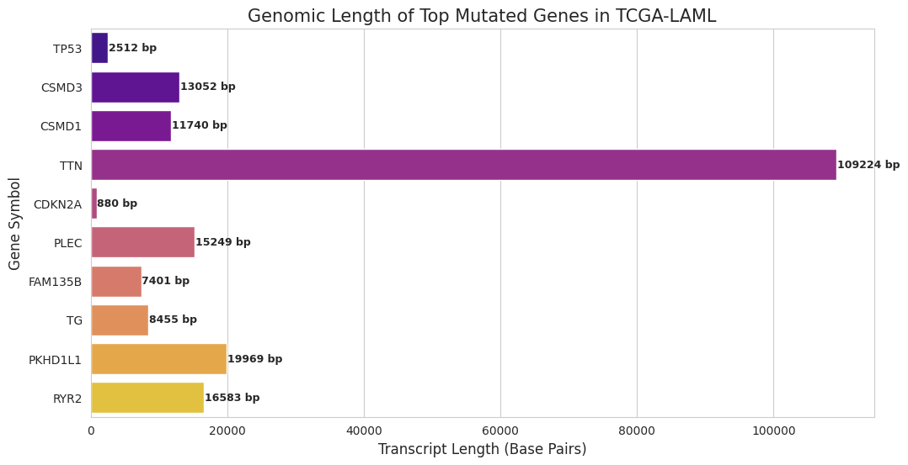

# 🧬 Integrated Multi-Omics Analysis for AML Biomarker Discovery

## 📋 Project Overview
This study implements a computational framework to integrate **Clinical, Transcriptomic (RNA-Seq), and Genomic** datasets, specifically targeting **Acute Myeloid Leukemia (TCGA-LAML)**. The primary objective is to elucidate the molecular drivers of leukemogenesis by correlating phenotypic clinical data with high-throughput molecular profiles.

## 🛠️ Technical Methodology & Pipeline
The analysis was executed through a custom-built Python pipeline designed for reproducibility and scalability:
* **Automated Data Acquisition:** Leveraging the **GDC REST API** for real-time retrieval of clinical and molecular data.
* **Bioinformatics Integration:** Utilizing `Biopython` for genomic sequence analysis and `Pandas` for high-dimensional data wrangling.
* **Robust Engineering:** Implementation of dynamic error-handling to manage API schema variations (e.g., handling index range shifts) ensuring data integrity during large-scale fetching.

---

## 📊 Phase 1: Clinical Cohort & Demographic Profiling
A cohort analysis of 100 AML patients was conducted to establish baseline clinico-pathological correlations.
* **Key Finding:** The cohort exhibited a mean age at diagnosis of **56.52 years**.
* **Clinical Insight:** A significant increase in disease prevalence was observed in patients **above age 60**, aligning with established hematological oncological literature regarding age-related mutational burden.

*Fig 1: Demographic distribution and age-at-diagnosis trends in the TCGA-LAML cohort.*

---

## 🧬 Phase 2: Transcriptomic Landscape (RNA-Seq Analysis)
Differential gene expression profiling was performed to identify high-abundance RNA transcripts within leukemic blast cells.
* **Dominant Marker:** Identification of **`MT-RNR2`** (Mitochondrial Ribosomal RNA 2) as a highly expressed transcript.
* **Biological Inference:** The significant enrichment of mitochondrial transcripts suggests a **Hyper-metabolic State**, reflecting the intense bioenergetic demands of malignant cellular proliferation and oxidative phosphorylation within the leukemic microenvironment.

*Fig 2: Top expressed transcripts identified via RNA-Seq read count normalization.*

---

## 🎯 Phase 3: Genomic Architecture & Mutational Density
This phase investigated the relationship between transcriptomic footprint (bp length) and somatic mutation frequency to distinguish between stochastic and driver mutations.
* **Size Bias Observation:** Large-scale genes like **`TTN`** (109,224 bp) naturally exhibit high raw mutation counts due to their massive genomic footprint.
* **Identification of Primary Driver:** In contrast, **`TP53`** was identified as a critical mutated gene despite its compact size (**2,512 bp**). This disproportionate mutation density relative to length underscores its role as a **Pivotal Genomic Driver** in AML pathogenesis.

*Fig 3: Correlation analysis between transcript length and mutation frequency, highlighting high-density driver mutations.*

---

## 🚀 Reproducibility & Environment
To replicate the analysis, ensure the following dependencies are installed:
1. **Requirements:** `pip install pandas biopython seaborn matplotlib requests`
2. **Execution:** Run `data_acquisition.py` to trigger the automated API fetch and visualization sequence.
